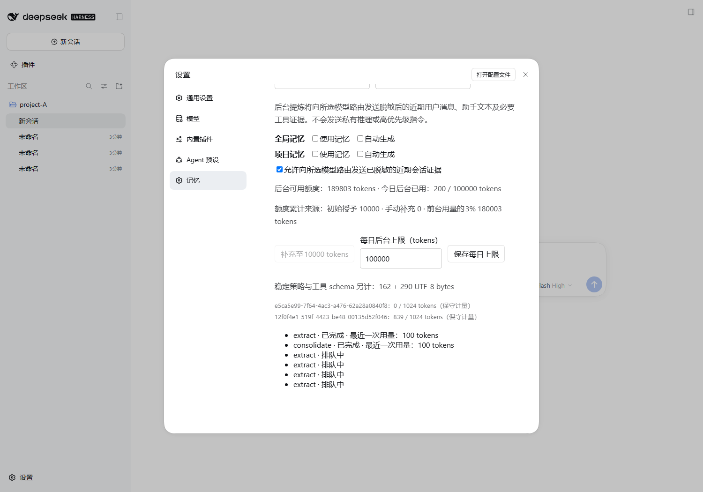

# 验证说明

公开JSON摘录来自已执行的隔离测试。0.1.5生产源码的SHA-256与0.1.4原验收基线逐文件匹配；该记录为历史证据。公开记录移除了本机绝对路径，原始日志在开发工作区保留。

0.1.5的生产逻辑保持不变，公开打包补充文档和许可，将可选Desktop测试目标改为显式环境变量。分发包重新构建，并实际安装核对设置页和memory/invoke。该验证不增加真实模型调用，不替代Desktop可见交互或真实远程验收。

`distribution.json`记录分发包版本、SHA-256、逐文件安装检查及实际环境；`verified-0.1.4.json`记录生产源文件的基线哈希。截图均来自合成数据的隔离Web环境。

0.1.6修复缺失的sessionPersistence依赖。原生上下文会拒绝未声明的服务访问，但旧测试使用另建Engine读取根上下文，未捕获该缺陷。新增 `tests/production-source.mjs` 使用实际插件的后台链路、默认zstd原生日志和固定适配器；修复前复现SOURCE_UNAVAILABLE，修复后提炼/整理通过。用户来源日志副本的范围和hash一致，原日志、配置和截图不公开。

0.1.6当轮检查结果见 `source-access-0.1.6.json`。该记录形成时未使用凭证、增加真实调用、修改credit或重启用户实例；后来用户已在隔离Desktop安装0.1.6并提交可见高级页面及真实调用失败证据。完整管理交互和真实远程仍需验收。

0.1.7按用户明确要求新增一次性初始10000、人工补充至10000及默认每日100000上限。原3%无初始授予规则仅在此前版本适用；当前初始和人工额度独立记账，不自动补满、不重置日费用、不解除未知usage暂停。八项必要测试覆盖旧配置档迁移、幂等、权限、并发、费用及诊断。

用户0.1.6实际后台调用结算1453 tokens，返回校验失败，旧记录未保存正文或字段诊断。0.1.7只增加安全诊断，不能据此宣称真实模型格式问题已解决。新版本实际模型闭环和Desktop完整验收仍待用户完成；自动化只使用固定模型，不读取其凭证。

0.1.7实际隔离Web已确认旧配置档不自动授予、人工补充至10000、分来源记录、每日上限保存及刷新/重启不补满。首次页面测试发现补充后的异步刷新可覆盖每日输入，已修复忙碌期间的输入状态并重跑通过；失败与修复均记录在 `budget-diagnostics-0.1.7.json`。分发包安装、逐文件一致性及Remote检查见 `distribution-0.1.7.json`。

图中额度、usage和任务来自固定模型边界夹具，不是用户实际余额或真实模型成功证据。
